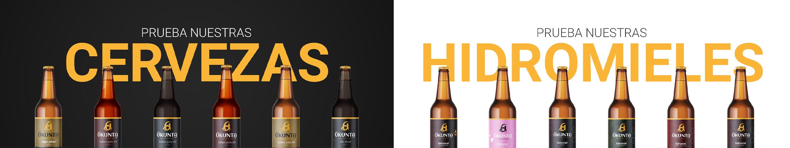
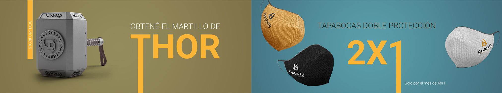
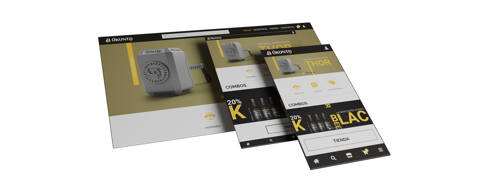

## Quiénes somos
Somos una familia de malteros de origen Escandinavo, que aún conserva las costumbres de nuestros ancestros, y nos dedicamos especialmente a lo que mejor sabemos hacer, destilar cerveza. Fundada por nuestros abuelos, allá por 1950, Ukunta conserva su toque tradicional, que hace de nuestras cervezas su especialidad y de nuestra hidromiel un viaje sin escala al medioevo.
Las distintas variedades que hemos creado y sus particulares sabores y aromas, nos hacen ser una opción que no podés dejar pasar.. queremos que disfrutes de esta pasión por lo que amamos y te unas a nuestra familia. 
¡Skål! 
## Misión
Aspiramos a convertirnos en un fuerte referente a la hora de elegir entre las posibilidades del mercado, para lograrlo hemos diseñado una serie de compromisos que forman parte de nuestra identidad. Ellos son la **Calidad**, se evidencia de inicio a fin en todos los procesos de elaboracion. La **Confianza**, nuestros clientes nos pueden elegir tranquilos porque siempre obtienen lo mejor y el **Compromiso**, todo el equipo de Ukunta trabaja unido para crear las mejores variedades.
## Publico Objetivo
Nuestro público objetivo son todas aquellas personas mayores de edad (+18) que estan apasionada por la civilización vikinga y que además sean amante de la calidad y el buen sabor de la cerveza/hidromiel.   
## Manual corporativo
Si quieres conocernos más en profundidad vea nuestro [Manual corporativo](./doc/identidadCorporativa_UKUNTA.pdf "Identidad Corporativa de Ukunta")

## Productos que vamos a comercializar

Nuestros productos se puede dividir en dos grandes categorias, las bebidas artesanales las cuales estan producidas con los procedimientos clásicos pero con nueva tecnología para lograr lo mejor de ambas épocas. 

Nuestro segundo producto aes el merchandaising.  
Usted puede ver nuestro **catálogo** completo en [Bebidas](./doc/catalogoBebidas_UKUNTA.pdf "Catálogo Bebidas") y [Merchandising](./doc/catalogoMerchandising_UKUNTA.pdf "Catálogo Merchandising")

## Nuestra web

Nuestro sitio web se encuentra diseñado bajo la modalidad *Mobile First*  para que usted nos pueda visitar sin importar el dispositivo, nuestro sitio se *adaptará* a tí.  
*Para saber más acerca de la web de Ukunta descarga nuestra* [documentación web](./doc/WebDesing_UKUNTA.pdf "Diseño web Ukunta"), en en donde encontrarás información detallada acerca de **diseño**, los **wireframes del sitio**, **tipografía** y **colores**. 

### Visita nuestros prototipos
[Mobile](https://www.figma.com/proto/202XsgvzJVP3LQusoLvBLl/grupo_1_UKUNTA?node-id=126%3A1&scaling=min-zoom "Prototype Mobile Figma"),
[Tablet](https://www.figma.com/proto/T7np7esUSfz9CvO23xPgtZ/desktop_tablet_UKUNTA?node-id=70%3A1134&scaling=scale-down&page-id=66%3A824 "Prototype Tablet Figma") y
[Desktop](https://www.figma.com/proto/T7np7esUSfz9CvO23xPgtZ/desktop_tablet_UKUNTA?node-id=1%3A3&scaling=scale-down&page-id=1%3A2 "Prototype Desktop Figma")

### Inspiración en referentes del mercado.

[Full Escabio](https://www.fullescabio.com/inicio.html)

Es un sitio referente en venta de bebidas, la utilizaremos como base en cuanto a que tiene un diseño clasico (header, carrousel, ofertas, categorias, footer). Tiene un buen diseño del boton flotante de WhatsApp.

[Pedite una goye](https://www.pediteunagoye.com.ar/)

Ademas de comercializar el mismo producto, es un sitio limpio a la vista, ordenado y claro. Nos gustó la manera de mostrar el producto al seleccionarlo, en la que tiene una imagen con la composición de la cerveza y una despcripcion clara de como seria el producto al consumirlo.

[Valhalla Brewing](https://www.valhallabrewing.com.au/)

En primera instancia comparte la paleta de colores que usaremos y tiene una historia basada en la cultura Vikinga, que es en lo que nos basaremos para dar a conocer el origen de nuestro producto.

[Cervelar](https://www.cervelar.com.ar/)

Nos gustó la estetica y los efectos que tienen las imagenes al posarte sobre ellas, el diseño del carrito de compras y que sea una single page, muy cómoda para la navegación.

[Epic Games](https://www.epicgames.com/store/es-ES/)

Tiene un carrousel que es comodo a la vista y a la navegación, ya que nos permite previsualizar todo el contenido que tiene el mismo y elegir el deseado sin tener que pasar por los productos previos.

[Desarmadero](https://desarmadero.com.ar/)

Nos gustó el hecho de no tener un menú aparte con las categorias, sino que están definidas dentro del home, podes visualizarlas al instante y navegar entre todas sin ser redireccionado a otra página.

[Valhallahidromiel](https://valhallahidromiel.com/es/)

Tomamos la página como referencia en base a la comercialización del mismo producto y la disposición de la navegación mobile.

[Cerveza Castrena](https://cervezacastrena.com/)

Similar a la última referencia, con detalles a tener en cuanta en la tienda versión mobile.
  
---  

## Acerca de nuestro grupo
Somos el grupo N°1 de la Comisión 6, nos hemos llamado **BERENG-1** en honor a la Poderosa *Berenjena*.   
Estamos conformado por cuatro integrantes
1. **Bernardo Dinarte**:
    Curioso, emprendedor y resiliente, amante de la música en todas sus expresiones. Bernardo de 36 años de edad, inicia su camino en el aprendizaje de la programación Web.
2. **Daniel Fernández**:
    Tiene 28 años y es un apasionado del arte digital y ahora de la mano del curso brindado por *Formar/Digital House*, comienza a crear otra nueva pasión, la programación.
3. **Emanuel Romero**:
    Actualmente tiene 32 años, vive en Lanús, Buenos Aires. Es estudiante de programación web fullstack y además le encanta aprender, desarrollar y amplicar sus conocimientos.
4. **Facundo Uehara**:
    31 años de edad, un amante de los videojuegos y actualmente se encuentra estudiando con un gran esmero programación web fullstack.
